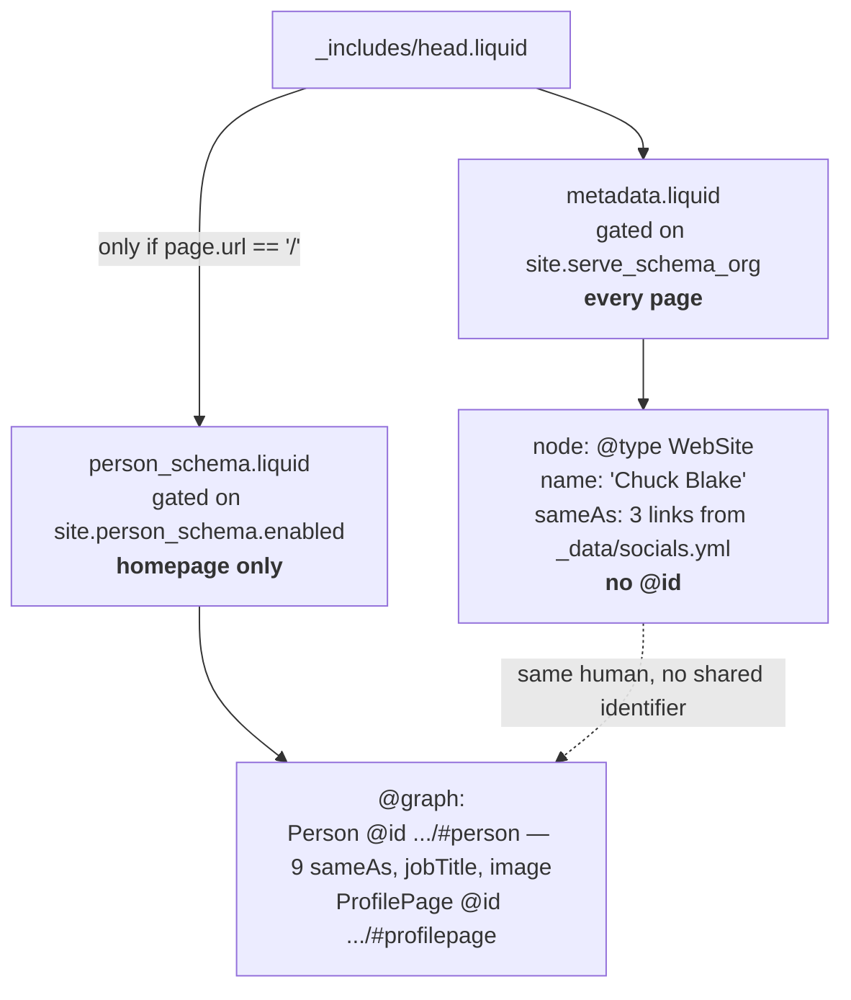

# CSB-3: Rewrite thin page meta descriptions and enable WebSite schema

## Goal

Give each `_pages/` entry a purpose-written meta description, and turn on the site-wide JSON-LD so it
describes one coherent entity graph instead of two competing claims about the same person.

Business contract lives in backlog issue **CSB-3** — this document covers only the engineering response.

---

## Context

### How descriptions render

`_includes/metadata.liquid` drives three tags off a single expression,
`{{ page.description }}{{ site.description }}`:

| Tag                         | Line | Gate                                    |
| --------------------------- | ---- | --------------------------------------- |
| `<meta name="description">` | 42   | always                                  |
| `og:description`            | 60   | `site.serve_og_meta` (currently `true`) |
| `twitter:description`       | 69   | `site.serve_og_meta`                    |

One frontmatter `description:` per page therefore satisfies all three. There is no separate Open Graph
field to set.

### The dual-purpose trap (the main copy constraint — resolved in Key Technical Decisions)

`_layouts/page.liquid:14` renders `{{ page.description }}` as a **visible** `<p class="post-description">`
directly beneath the page `<h1>`. So for pages using `layout: page`, the description is simultaneously
the SEO snippet _and_ on-page subheading copy. It must read as natural human subhead prose, not as an
SEO string.

| Page                       | Layout    | Description visible on page?                           | Current value                                   | Len |
| -------------------------- | --------- | ------------------------------------------------------ | ----------------------------------------------- | --- |
| `_pages/about.md`          | `about`   | **No** — `_layouts/about.liquid` has its own hero copy | _(absent)_ → falls back to `site.description`   | —   |
| `_pages/blog.md`           | `default` | **No**                                                 | _(absent)_ → falls back to `site.description`   | —   |
| `_pages/fractional-cto.md` | `page`    | **Yes**                                                | "Technical leadership for early-stage startups" | 45  |
| `_pages/projects.md`       | `page`    | **Yes**                                                | "Things I'm building"                           | 19  |
| `_pages/publications.md`   | `page`    | **Yes**                                                | "Writing, talks, and coverage."                 | 29  |
| `_pages/music.md`          | `page`    | **Yes**                                                | "Shows I've been to"                            | 18  |

`_pages/404.md` already has a description and is out of scope.

### The JSON-LD conflict (the substantive decision)

Two independent blocks emit structured data, with different scopes:



`person_schema.liquid` is well-formed: a `Person` with a stable `@id` of `https://chuckblake.com/#person`,
plus a `ProfilePage` whose `mainEntity` points back at it.

The stock al-folio block at `_includes/metadata.liquid:229-246` is not. Flipping `serve_schema_org: true`
as-is emits, on every page, a node that:

- is typed `WebSite` but carries `"name": "Chuck Blake"` — a person's name on a website entity
- carries a `sameAs` array built from `_data/socials.yml` (3 links: twitter, linkedin, github) that
  **disagrees** with the Person node's 9-entry `sameAs`
- nests `"author": {"@type": "Person", "name": "Chuck Blake"}` with no `@id`
- has **no `@id` of its own**, so nothing can reconcile it by reference

On the homepage that produces two unlinked, mutually inconsistent entity claims about Chuck Blake.
This is the "no duplicate-entity conflicts" clause in CSB-3 — it is not satisfiable by flipping the flag.

Adjacent defect in the same block: `_includes/metadata.liquid:238` reads ``.
Liquid has no `else if` (it is `elsif`); the tag silently degrades to a bare ``. Harmless today
because the fallback is the same value, but it is dead-wrong syntax sitting in the block being rewritten.

### Build and verification

No test suite exists. `bundle exec jekyll build` works locally (ruby 3.3.10, bundler 4.0.8); Docker
(`docker compose up`, port 8080) is the AGENTS.md-documented path. Verification must read the **built**
`_site/` output, not the sources — AC #3 is explicitly about rendered HTML. CI runs prettier
(`.github/workflows/prettier.yml`), so `npx prettier . --write` before commit is mandatory.

---

## Key Technical Decisions

**Rewrite the vendored `_includes/metadata.liquid` JSON-LD block rather than working around it.**
Three options were weighed:

| Option                                                                                     | Verdict                                                                                                                                                 |
| ------------------------------------------------------------------------------------------ | ------------------------------------------------------------------------------------------------------------------------------------------------------- |
| Leave `serve_schema_org: false`; add a `WebSite` node to `person_schema.liquid`'s `@graph` | Rejected — CSB-3 explicitly requires the config flag on, and this leaves the broken block one toggle away from being re-enabled by a future config edit |
| New site-local override include, flag stays off                                            | Rejected — same latent-landmine problem, plus a second file emitting overlapping types                                                                  |
| **Flip the flag and fix the block in place**                                               | **Chosen**                                                                                                                                              |

Editing vendored al-folio files is already established practice in this fork (`head.liquid` carries the
homepage-only `person_schema` include; `about.liquid` is substantially rewritten). Fixing the block where
it lives means the flag can never be flipped back into a broken state.

**Decouple the SEO string from the visible subhead: add `meta_description`.** The four `layout: page`
pages render `page.description` as a visible `<p class="post-description">` under the `<h1>`. Three facts
make dual-purposing it the wrong call:

- `_sass/_blog.scss:154` styles `.post-description` at `0.875rem` — small type sized for a one-line
  tagline. A 120–160 character string there is a paragraph of small print between a one-word heading
  (`music`, `projects`) and the page's actual content (a shows table, a card grid).
- This is the same objection that excludes `_projects/` below. Applying it there and not here would be
  inconsistent.
- `bin/verify-meta.rb` reads `<meta>` tags only, so it would pass no matter how badly the visible
  subheads read. Nothing else would catch the regression.

So: add an optional `meta_description` frontmatter field, consumed **only** by `_includes/metadata.liquid`,
falling back to `description` and then `site.description`. `description` keeps its current job as visible
subhead copy (and still gets improved past placeholder text — CSB-3 is right that "Things I'm building"
is weak); `meta_description` carries the 120–160 character search string.

Rejected alternatives: making `_layouts/page.liquid` render `page.subtitle` instead would strip the
visible subhead from all nine `_projects/` detail pages, which also use `layout: page` — a real regression.
(`subtitle:` is not a usable convention here anyway: the one in `_pages/about.md` has no reader and is
dead frontmatter.) Accepting dual purpose was rejected on the styling evidence above.

This is close to free: the fallback expression is currently **triplicated** across
`metadata.liquid:42/60/69`. Replacing all three with one `` is a net simplification that
happens to add the new field.

**Give every emitted node a stable `@id`; let `@id` do the reconciliation.** A `WebSite` at
`{site.url}/#website` emitted on every page is not duplication — repeated identical `@id`s denote one
entity, which is exactly how consumers merge JSON-LD graphs across a site. This is the standard pattern
(Yoast and similar emitters do the same).

**`sameAs` belongs to the Person, not the WebSite.** Dropping it from the WebSite node removes the
conflicting 3-link array and leaves `person_schema.liquid`'s 9-link array as the single entity graph.
Consequence: the ~145-line `sameaslinks` generator at `_includes/metadata.liquid:81-227` becomes dead
code and should be deleted with it — a large, low-risk simplification that is a direct result of this fix,
not scope creep.

**Reference `#person` by `@id` only; never redefine it.** The `WebSite` node's `publisher` and the
`BlogPosting` node's `author` point at `{"@id": ".../#person"}` without restating any Person properties.
On interior pages this is a dangling reference (the Person node is only defined on the homepage), which is
valid JSON-LD and standard practice. Restating even a name-only Person stub is what would risk
reintroducing a competing definition.

**Exclude `_projects/` from the description rewrite.** The issue lists it as optional-if-quick. It is not
appropriate: `_includes/projects.liquid:16` renders `project.description` as visible card body text in the
grid on `/projects/`, so padding those nine entries to 120–160 characters would visibly bloat the card
layout. The existing project descriptions are already specific and well-written — they are card copy doing
its job, not placeholder filler. See Open Questions.

---

## Files

One path per line, each with an explicit `Create:` / `Modify:` / `Test:` prefix — that is the shape
`cb-lib/scope-check` parses (`DECLARATION_BULLET`), and cb-done halts on any changed file it cannot
match here.

- Create: `bin/verify-meta.rb` — build-output verification gate
- Modify: `_includes/metadata.liquid` — U2 collapses the triplicated description expression into one ``; U3 rewrites the JSON-LD block, deletes the `sameaslinks` generator, fixes the `else if` bug
- Modify: `_config.yml` — U1 excludes `plans/`; U3 sets `serve_schema_org: true`
- Modify: `SEO.md` — correct the two sections that misdescribe what the flag emits (see Documentation Notes)
- Modify: `_pages/about.md` — add `description:` (meta-only; no visible render)
- Modify: `_pages/blog.md` — add `description:` (meta-only; no visible render)
- Modify: `_pages/fractional-cto.md` — add `meta_description:`; tighten visible `description:`
- Modify: `_pages/projects.md` — add `meta_description:`; tighten visible `description:`
- Modify: `_pages/publications.md` — add `meta_description:`; tighten visible `description:`
- Modify: `_pages/music.md` — add `meta_description:`; tighten visible `description:`
- Modify: `.claude/cb.yml` — prettier formatting only; pre-existing violation that fails CI (see Decisions)
- Test: `bin/verify-meta.rb` — run against `_site/` after `bundle exec jekyll build`

---

## Plan

### U1. **Build-output verification script**

**Goal:** A checked-in, re-runnable gate that reads built HTML and fails loudly on every condition CSB-3
cares about. Written first so U2 and U3 have an objective target and `/cb:done` can re-run it.

**Dependencies:** None.

**Files:**

- Create: `bin/verify-meta.rb`
- Modify: `_config.yml` — add `plans/` to `exclude` (discovered during U1; see Decisions)

**Approach:**

- Ruby stdlib only (`json`, `set`) — no new gems, no `Gemfile` change. Ruby is already required to build.
- Takes an optional `_site` root argument, defaulting to `_site`. Exits non-zero on any failure and prints
  every failure, not just the first — a one-shot run should show the full remaining gap.
- Resolve each target page by permalink → `_site/<path>/index.html`: `/`, `/blog/`, `/fractional-cto/`,
  `/projects/`, `/publications/`, `/music/`.
- Extract tag content by regex against the built HTML; extract `<script type="application/ld+json">`
  bodies and `JSON.parse` each; extract `<p class="post-description">` text for the visible-subhead bound.

**Execution note:** Test-first. Land this unit before U2/U3 and confirm it fails against the current
site — a verification script that has never been seen to fail proves nothing.

**Patterns to follow:** `bin/` already holds standalone executables (`cibuild`, `deploy`,
`update_scholar_citations.py`); match that shape — executable bit, shebang, no framework coupling.

**Test scenarios:**

- Happy path: against a correctly-built site, exits 0 and prints a per-page summary line.
- Error path: a page whose description is 45 chars → fails naming the page, the actual length, and the
  120–160 bound.
- Error path: two pages sharing an identical description → fails naming both paths.
- Error path: a page missing `<meta name="description">` entirely → fails, and is distinguished from the
  length failure.
- Error path: `og:description` or `twitter:description` differing from `<meta name="description">` on the
  same page → fails (guards against a future template edit desynchronizing them).
- Error path: a malformed JSON-LD block that will not `JSON.parse` → fails naming the page.
- Error path: two JSON-LD nodes on one page declaring the same `@id` with different `@type` → fails.
- Error path: a top-level JSON-LD node with no `@id` at all → fails (this is precisely the pre-fix
  `WebSite` node, so it is the assertion that pins U3).
- Error path: on the four `layout: page` pages, a visible `<p class="post-description">` longer than
  ~70 characters → fails. This is the guard for the decoupling decision: without it nothing catches a
  future edit that pastes the 120–160 character search string back into the visible subhead.
- Edge case: `_site/` absent or a target page missing → fails with a clear "build the site first" message
  rather than a `nil` backtrace.

**Verification:** Run against the current unmodified build; it reports failures for every page in the
table above and for the JSON-LD `@id` assertions. That failing output is the unit's deliverable.

---

### U2. **Rewrite `_pages/` meta descriptions**

**Goal:** Six unique 120–160 character descriptions aimed at consulting clients and employers doing
due diligence.

**Dependencies:** U1.

**Files:**

- Modify: `_includes/metadata.liquid` — description expression only
- Modify: `_pages/about.md`
- Modify: `_pages/blog.md`
- Modify: `_pages/fractional-cto.md`
- Modify: `_pages/projects.md`
- Modify: `_pages/publications.md`
- Modify: `_pages/music.md`
- Modify: `.claude/cb.yml` — prettier only; pre-existing CI failure
- Test: `bin/verify-meta.rb`

**Approach:**

First land the template change that makes the rest possible. In `_includes/metadata.liquid`, replace the
triplicated fallback at lines 42, 60, and 69 with a single assignment near the top of the file:

```liquid

```

_Directional — the exact filter chain is the implementer's call; `| default:` treats an empty string as
present, so an explicit `` chain may be safer._ Then reference `page_meta_description` in all
three tags. Nothing else in the repo reads those lines, and `_layouts/page.liquid:14` keeps rendering
`page.description` untouched.

Then write copy, split by whether the page renders the description visibly:

- **Meta-only** — `about.md` (`layout: about`) and `blog.md` (`layout: default`). Neither layout reads
  `page.description`, so `description:` alone carries the 120–160 search string. No `meta_description`
  needed.
- **Two-field** — `fractional-cto.md`, `projects.md`, `publications.md`, `music.md` (all `layout: page`).
  `meta_description:` carries the 120–160 search string; `description:` stays a short visible subhead —
  improved past the current placeholders, but sized for `0.875rem` tagline type and not repeating the
  `<h1>` sitting directly above it.

Per-page angle for the **search string** — directional, not final copy; write to the content, and count
characters against the 120–160 bound:

| Page                | Angle                                                                                                                                        |
| ------------------- | -------------------------------------------------------------------------------------------------------------------------------------------- |
| `about.md`          | Brooklyn founder / fractional CTO; AI systems and developer tools; names the LEA outcome as the credibility anchor                           |
| `fractional-cto.md` | The engagement itself — what a founder gets, what problems it solves, without an executive hire                                              |
| `projects.md`       | Shipped work as evidence: named products, actually in production                                                                             |
| `publications.md`   | Writing, talks, and coverage; the _In General_ newsletter; what the thinking is about                                                        |
| `blog.md`           | Essays on startups, technology, and AI engineering — matches `site.blog_description` in tone                                                 |
| `music.md`          | Live shows and the Corvoco electronic-music project; the honest personal-interest page, positioned as range rather than padded with keywords |

Do not touch `_posts/` (already good, per CSB-3) or `_projects/` (see Key Technical Decisions).

**Patterns to follow:** Existing `_projects/*.md` descriptions are the house voice for this kind of
copy — concrete, specific, em-dash qualifier, no marketing padding.

**Test scenarios:**

- Happy path: all six pages present, unique, 120–160 chars — `bin/verify-meta.rb` length/uniqueness
  assertions pass.
- Happy path: `og:description` and `twitter:description` mirror `<meta name="description">` on all six
  (this is what proves the single `` feeds all three tags).
- Happy path: on the four two-field pages, the emitted `<meta name="description">` is the
  `meta_description` value, **not** the short visible `description`.
- Edge case: a page with `description` but no `meta_description` (e.g. `_pages/404.md`, every
  `_projects/*.md`) still emits its `description` as the meta tag — the fallback must not regress
  untouched pages.
- Edge case: a page with neither field falls back to `site.description`.
- Integration: the four `layout: page` pages still render their short `description` as
  `<p class="post-description">`, and the long search string appears nowhere in the visible body.
- Integration: all nine `_projects/*.md` detail pages (also `layout: page`) are visually unchanged.
- Integration: `/` no longer falls back to `site.description` ("CTO, entrepreneur, and startup operator.").
- Edge case: descriptions containing an apostrophe or colon must be YAML-quoted so the frontmatter still
  parses — `title: "My: Cool Site"` per AGENTS.md.

**Verification:** `bin/verify-meta.rb` passes every description assertion; JSON-LD assertions still fail
(U3 has not landed).

---

### U3. **Reconcile and enable the site-wide JSON-LD graph**

**Goal:** `serve_schema_org: true` emitting a coherent, `@id`-anchored graph that composes with the
existing Person schema instead of competing with it.

**Dependencies:** U1. Also land after U2 — both edit `_includes/metadata.liquid`, and the rewritten
JSON-LD node should consume the `page_meta_description` assignment U2 introduces rather than duplicating
the fallback a fourth time.

**Files:**

- Modify: `_config.yml`
- Modify: `_includes/metadata.liquid`
- Modify: `SEO.md`
- Test: `bin/verify-meta.rb`

**Approach:**

- `_config.yml:70` → `serve_schema_org: true`. Update the trailing comment, which currently describes the
  old broken behavior.
- Rewrite `_includes/metadata.liquid:229-246`. Target shape, directional:
  - `WebSite` — `@id: {site.url}/#website`, `name: site.title` (**not** `author_name`),
    `url: site.url`, `description: site.description`, `publisher: {"@id": "{site.url}/#person"}`
  - blog posts — `BlogPosting` at `@id: {absolute page.url}#blogposting`, with
    `author: {"@id": "{site.url}/#person"}`, `isPartOf: {"@id": "{site.url}/#website"}`, `headline`,
    `description`, and `mainEntityOfPage`
  - no `sameAs` on either node
  - pipe every interpolated value through `| jsonify`, mirroring `person_schema.liquid`, instead of the
    current bare `"{{ ... }}"` string interpolation — that is what makes an apostrophe or quote in a
    description a JSON syntax error today
- Delete the now-unreferenced `sameaslinks` generator (`_includes/metadata.liquid:81-227`) and its
  `` header. Confirm by grep that `sameaslinks` has no other reader before deleting.
- Fix `` → `` at line 238 (or drop the branch entirely — after U2 the rewritten
  node should read `page_meta_description`, which already has the fallback baked in).
- Correct exactly two `SEO.md` sections — **Enable in al-folio** (164-176) and **What Gets Marked Up**
  (178-197). Not a general `SEO.md` rewrite: the rest is generic vendored al-folio guidance that is not
  this issue's business.

**Execution note:** Verify the emitted JSON-LD against validator.schema.org before considering the unit
done — `bin/verify-meta.rb` proves the graph is structurally coherent, not that it is schema.org-valid.
Those are different claims and CSB-3 asks for both.

**Patterns to follow:** `_includes/person_schema.liquid` — `@graph`, stable `@id` anchors, `| jsonify`
on every interpolated value, ``-guarded optional keys so no trailing comma is emitted.

**Test scenarios:**

- Happy path: every page's JSON-LD parses; every top-level node carries an `@id`.
- Happy path: homepage emits `Person`, `ProfilePage`, and `WebSite` — three distinct `@id`s, no `@type`
  collision on a shared `@id`.
- Happy path: an interior page (e.g. `/music/`) emits the `WebSite` node with the identical `@id` used on
  the homepage.
- Happy path: a blog post emits `BlogPosting` with `author` and `isPartOf` as `@id` references.
- Edge case: a description containing an apostrophe (likely in the new U2 copy) still yields parseable
  JSON — the regression the `| jsonify` change exists to prevent.
- Integration: paste homepage and one interior page into validator.schema.org; no errors, and Chuck Blake
  resolves to a single Person entity.
- Integration: `sameAs` appears exactly once site-wide, on the homepage Person node.

**Verification:** `bin/verify-meta.rb` exits 0 against a fresh build; validator.schema.org reports no
errors on the homepage, one interior page, and one blog post; and `SEO.md`'s Schema.org sections describe
what the code now actually emits.

---

## System-Wide Impact

- **Blast radius:** `_includes/metadata.liquid` is included by `head.liquid`, which every layout inherits
  via `_layouts/default.liquid`. A Liquid syntax error there breaks the entire build — the whole-site
  build in U3's verification is what catches it.
- **Shared file, sequential units:** U2 and U3 both edit `_includes/metadata.liquid`, in disjoint regions
  (the description expression near the top vs. the JSON-LD block at the bottom). Land U2 first so U3's
  node can consume `page_meta_description`.
- **`_projects/` and `_pages/404.md`:** untouched, but they also use `layout: page` and will flow through
  the new `page_meta_description` fallback. The fallback-regression scenarios in U2 are what confirm they
  render identically before and after.
- **Unchanged invariants:** `_includes/person_schema.liquid` is not modified. Its homepage-only inclusion
  at `_includes/head.liquid:4-6` stays as-is. `serve_og_meta` stays `true`; the og/twitter tags keep
  reading the same expression, so they inherit the new descriptions for free.
- **Deleting `sameaslinks`:** verified — `sameaslinks` has no reader anywhere outside
  `_includes/metadata.liquid`. `site.serve_schema_org` is likewise read in exactly one place,
  `metadata.liquid:79`; the only other repo mentions are prose in `SEO.md` (see Documentation Notes).
- **CI:** `prettier.yml` and `prettier-html.yml` will fail the PR if `npx prettier . --write` is not run.
  `broken-links-site.yml` and `axe.yml` also run against the built site but are not affected by
  metadata-only changes.
- **`_posts/` descriptions:** untouched, but they flow through the same rewritten `BlogPosting` branch —
  U3's blog-post scenario is what confirms no regression there.

---

## Risks & Dependencies

| Risk                                                                                    | Mitigation                                                                                                                                                                                                       |
| --------------------------------------------------------------------------------------- | ---------------------------------------------------------------------------------------------------------------------------------------------------------------------------------------------------------------- |
| Liquid syntax error in `metadata.liquid` breaks every page                              | U3 requires a full `bundle exec jekyll build` before the unit is done, not a spot check                                                                                                                          |
| An apostrophe in new description copy produces invalid JSON-LD                          | Switch to `\| jsonify`; U3 carries an explicit edge-case scenario for it                                                                                                                                         |
| A 120–160 char string reads badly as a visible subhead on the four `layout: page` pages | Called out as the primary copy constraint in U2; visual check in the built site is an explicit scenario                                                                                                          |
| Dropping `sameAs` from the WebSite node weakens entity signals                          | It does not — the 9-entry Person `sameAs` is strictly richer than the 3 links being removed, and it is the array search engines should be reading                                                                |
| Vendored-file edits complicate a future al-folio upstream merge                         | Accepted; the fork already carries vendored edits to `head.liquid` and `about.liquid`. The alternative (a parallel override include) is worse — it leaves a broken block one config toggle away from re-enabling |

---

## Documentation Notes

`SEO.md` (repo root, 536 lines) is vendored al-folio documentation and is the origin of CSB-3's
120–160 character rule (`SEO.md:355`) and of the instruction to flip this flag (`SEO.md:164-176`).

It is also **wrong about the code**, which is worth recording because it is what makes this issue look
like a one-line change. Its Schema.org section says of `serve_schema_org: true`: _"That's it! al-folio
automatically marks up: Author info (Person schema with name, URL, photo)"_ — the block does not emit a
Person node at all. It emits a `WebSite` node that merely carries a person's name. That doc is very likely
why CSB-3 describes the flag as complementing the Person schema at no cost.

After U3, two sections of `SEO.md` misdescribe this site's actual behavior: **Enable in al-folio**
(`164-176`) and **What Gets Marked Up** (`178-197`). Update both to describe the `@id`-anchored graph and
to point at `_includes/person_schema.liquid` as the owner of the Person entity. The SEO Checklist at
`469-500` needs no change — its `serve_schema_org: true` and "every page has description (120-160 chars)"
boxes are exactly what this issue ticks.

Treat this as part of U3 rather than a follow-up: leaving a doc in the repo that contradicts the code it
documents is how this same mistake gets made again.

---

## Open Questions

### Resolved during planning

- **Does adding `description:` to `about.md` double-render on the homepage?** No. `_layouts/about.liquid`
  renders its own hero markup and never reads `page.description`.
- **Which pages show the description visibly?** The four `_pages/` entries using `layout: page` — plus all
  nine `_projects/*.md` and `_pages/404.md`, which use the same layout. `about` and `blog` do not.
- **Should the SEO string and the visible subhead be the same string?** No. Decoupled via a new
  `meta_description` field; see Key Technical Decisions for the alternatives weighed and why the
  `page.liquid`-renders-`subtitle` variant was rejected.
- **Can the flag simply be flipped?** No — that is what creates the entity conflict CSB-3 forbids. The
  `metadata.liquid` rewrite is the substance of the issue.
- **Fix in place, or work around the vendored file?** Fix in place; see Key Technical Decisions.

### Deferred to implementation

- **Final description copy.** The per-page angles above are direction; exact wording and character counts
  land during U2 against `bin/verify-meta.rb`.
- **Exact `metadata.liquid` line ranges after deletion.** Removing the `sameaslinks` generator shifts
  everything below it; work from the block structure, not the line numbers quoted here.

### Raised back to the backlog

- **A new `meta_description` frontmatter field is being added**, which widens CSB-3's stated scope
  ("frontmatter description edits and the one config flag") by one template change. Rationale in Key
  Technical Decisions. Recorded as a comment on CSB-3.
- **`_projects/` is being excluded from the description rewrite** despite CSB-3 listing it as
  optional-if-quick. Rationale in Key Technical Decisions: those strings render as visible card body text,
  and the existing copy is already good. Recorded as a comment on CSB-3 rather than silently dropped.

---

## Decisions

### `plans/` must be excluded from the Jekyll build — 2026-07-27

Adding this plan file broke `bundle exec jekyll build`:
`Liquid syntax error (line 74): Unexpected outer 'else' tag`. Jekyll was treating `plans/*.md` as
site content and **executing** the Liquid snippets the plan quotes when describing
`_includes/metadata.liquid`. Two problems in one: the build fails, and a dev artifact would have
been published to chuckblake.com.

Picked: add `plans/` and `.plans-archive/` to `_config.yml`'s `exclude` list. `bin/` was already
excluded, so `bin/verify-meta.rb` needed nothing.

Rejected: wrapping every Liquid snippet in the plan in ``. That fixes one file and leaves
the trap armed — this repo adopted the cb workflow in `cc8ae40`, so every future plan would hit it,
and nothing would stop plans publishing to the live site.

Folded into U1 because U1's gate reads built output and therefore cannot run at all until the build
succeeds.

### Meta description length is measured on normalized whitespace — 2026-07-27

`bin/verify-meta.rb` initially measured the raw `content` attribute, reporting 41 characters for the
40-character `site.description`. The extra character is the trailing newline from that value's YAML
folded scalar (`description: >`).

Picked: normalize (collapse whitespace runs, trim) before length-checking, matching what a search
engine displays. Left as-is, a 160-character description written with `>` folding would report 161
and fail for a reason nothing in the output names.

### The WebSite node carries `site.description`, not the page's — 2026-07-27

First cut of U3 emitted `page_meta_description` on the `#website` node. That node is emitted on every
page under one stable `@id`, so the same entity ended up asserting a different description depending
on which page a consumer crawled — the subtler form of the exact defect this unit exists to remove.
The per-page `@id`/`@type` check could not see it, because it only ever examines one page at a time.

Picked: the WebSite node carries `site.description` and is byte-identical everywhere. Per-page copy is
already served by `<meta name="description">`, which is what search snippets actually read.

Added the assertion that catches it: `bin/verify-meta.rb` now collects the `#website` node from every
page and fails if any two differ, naming the differing keys. Negative-tested by perturbing one page's
copy in a fixture.

### Formatting `.claude/cb.yml` — pre-existing, and it fails CI — 2026-07-27

`npx prettier . --check` (`.github/workflows/prettier.yml:26`, no `continue-on-error`, so it fails the
job) flags `.claude/cb.yml`. The file is byte-identical to `main`, so this is pre-existing: CI's
prettier job is already red on `main` and this PR would inherit that regardless of its own changes.

Picked: run the AGENTS.md pre-commit step (`npx prettier . --write`) and let it format that file —
6 lines, formatting only, no semantic change. That is the repo's own documented convention, and CI
cannot go green without it.

Not treated as scope creep, but it is the one file in this branch that CSB-3 did not ask for.

### Local builds need `nbconvert`; this is not a branch regression — 2026-07-27

`bundle exec jekyll build` fails locally with
`JekyllJupyterNotebook::Converter ... No such file or directory - jupyter` on
`assets/jupyter/blog.ipynb`. That file is untouched by this branch, and `.github/workflows/deploy.yml:94`
provisions it with `pip3 install --upgrade nbconvert`, so CI is unaffected. Contributors building
locally need `nbconvert` on `PATH` (a virtualenv is enough; macOS system Python refuses the install
under PEP 668).

---

## Sources & References

- Backlog issue: CSB-3 (markdown backend, Chuck Vault `cb-dev/chuckblake.com/backlog`)
- `_includes/metadata.liquid` — description tags (42, 60, 69), `sameaslinks` generator (81-227), JSON-LD block (229-246)
- `_includes/person_schema.liquid` — the correct `@graph` pattern to mirror
- `_includes/head.liquid:4-6` — homepage-only Person schema inclusion
- `_layouts/page.liquid:14` — visible `post-description` render
- `_includes/projects.liquid:16` — visible project card description render
- `_config.yml:70` — `serve_schema_org` flag
- `SEO.md:164-197` (Schema.org sections, inaccurate), `SEO.md:355` (origin of the 120–160 char rule), `SEO.md:469-500` (SEO checklist)
- `AGENTS.md` — Docker build, prettier pre-commit checklist
